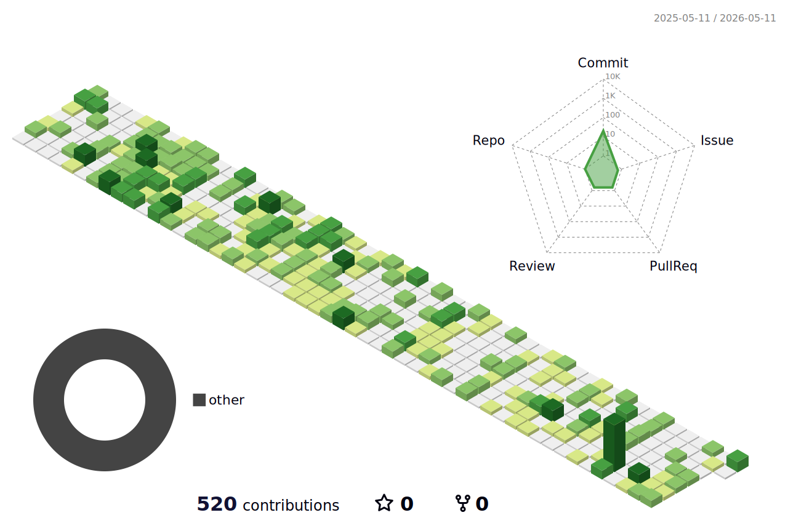

# Fabio G. Nunes

**Head de TI & Desenvolvedor Full-Stack** · Rio de Janeiro, BR

Construo ferramentas internas, gerencio infraestrutura e escrevo o código que mantém um escritório de contabilidade funcionando.

---

### O que eu faço

Lidero a TI da **MPCN Projetos e Contabilidade**, cuidando de toda infraestrutura de rede (pfSense, MikroTik, dual-WAN, VPN) e desenvolvendo sistemas internos sob medida. Em paralelo, mantenho projetos pessoais em [fgndev.com.br](https://fgndev.com.br).

### Stack

**Linguagens & Frameworks**

**Infraestrutura & DevOps**

**Ferramentas & Banco de Dados**

---

### Estatísticas

<table>
  <tr>
    <td>
      
    </td>
    <td>
      
    </td>
  </tr>
</table>

---

### Linguagens (todos os repositórios)

  

---

### Contribuições

<picture>
  <source media="(prefers-color-scheme: dark)" srcset="./profile-3d-contrib/profile-night-rainbow.svg" />
  <source media="(prefers-color-scheme: light)" srcset="./profile-3d-contrib/profile-green-animate.svg" />
  
</picture>

---

Atualizado diariamente via GitHub Actions.
