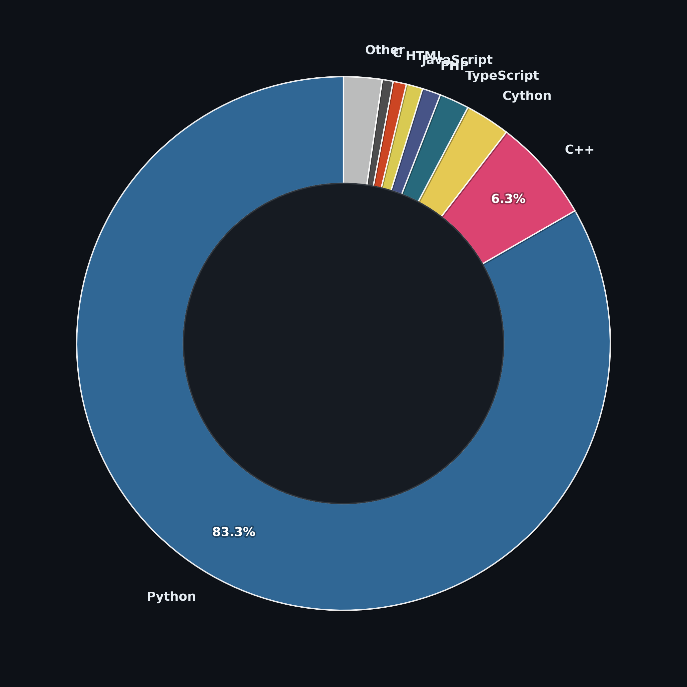

<h1 align="center">Olá 👋, eu sou o Fabio G. Nunes</h1>

  <strong>🇧🇷 Desenvolvedor & Head de TI</strong> 
  PHP · Vue.js · Flutter · C#/.NET · Automação · Infraestrutura

  <a href="https://fgndev.com.br">🌐 fgndev.com.br</a> •
  <a href="https://www.linkedin.com/in/fabio-g-nunes/">💼 LinkedIn</a>

---

### 🧑‍💻 Sobre mim

- 🏢 Head de TI na **MPCN Projetos e Contabilidade**
- 🔧 Gestão de infraestrutura: pfSense, MikroTik, VPN, Docker Swarm
- 📱 Desenvolvimento mobile com **Flutter**
- 🖥️ Backend com **PHP** (Clean Architecture, SOLID) e **C#/.NET**
- 🎨 Frontend com **Vue.js 3**
- 🏠 Entusiasta de automação residencial (ESP8266, Raspberry Pi)

---

### 📊 Contribuições 3D

<picture>
  <source media="(prefers-color-scheme: dark)" srcset="./profile/3d-contrib/profile-night-rainbow.svg" />
  <source media="(prefers-color-scheme: light)" srcset="./profile/3d-contrib/profile-green-animate.svg" />
  
</picture>

---

### 📈 GitHub Stats

  
   
  

---

### 🔤 Linguagens (repos públicos + privados)

  

---

  <i>⚡ Gerado automaticamente por GitHub Actions</i>

